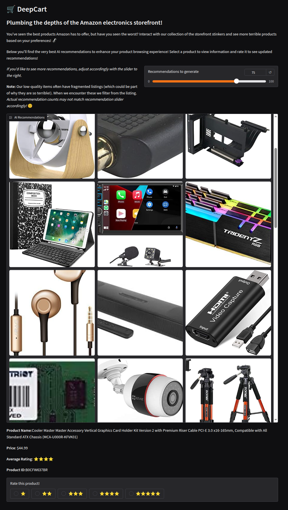

# DeepCart - Amazon Electronics Recommender System

DeepCart is a tool to sift through Amazon electronics purchase historicals and source recommendations to drive customer engagement. With a twist. DeepCart mines reviews for the *worst* surviving products with non-trivial user engagement. Reviews you submit adjust the recommendations to match your preferences. 

**Demonstration:** The application is hosted for 1 week startig 23 July 2025 here: https://90751de224cba641f9.gradio.live

## Problem 

Everyone has experience with being fed recommendations for interactions that will please them, but there's no analogous recommender system for finding terrible products or products we should avoid. DeepCart gives us a tool to mine reviews for just that. 

## Data Sources

The University of California at San Diego (UCSD) Amazon Review 2023 dataset is the sole source of user interaction data mined for this project. From the project page, the dataset consists of 
- User Reviews (ratings, text, helpfulness votes, etc.);
- Item Metadata (descriptions, price, raw image, etc.);
- Links (user-item / bought together graphs).

We are specifically concerned with the Electronics subset of this expansive dataset, which consists of 18.3 million user reviews, 1.6M items and 43.9 million ratings. Subsampling on users was conducted to reduce the computational complexity of generating recommendations across all models tested. 
  
## Prior Efforts 

To the author's knowledge, no prior efforts exist to leverage this reviews dataset to make recommendations using an autoencoder or to recommend negative reviews for comedic effect. However, a huge body of work exists on autoencoders and their application in the recommender system context. 

See: 
1. Zhang, G., Liu, Y. & Jin, X. A survey of autoencoder-based recommender systems. Front. Comput. Sci. 14, 430–450 (2020). https://doi.org/10.1007/s11704-018-8052-6 ​
2. Suvash Sedhain, Aditya Krishna Menon, Scott Sanner, and Lexing Xie. 2015. AutoRec: Autoencoders Meet CollaborativeFiltering. In Proceedings of the 24th International Conference on World Wide Web (WWW '15 Companion). Associationfor Computing Machinery, New York, NY, USA, 111–112. https://doi.org/10.1145/2740908.2742726 ​
3. Sheng Li, Jaya Kawale, and Yun Fu. 2015. Deep Collaborative Filtering via Marginalized Denoising Auto-encoder. In Proceedings of the 24th ACM International on Conference on Information and Knowledge Management (CIKM '15). Association for Computing Machinery, New York, NY, USA, 811–820. https://doi.org/10.1145/2806416.2806527
4. Ouyang, Y., Liu, W., Rong, W., Xiong, Z. (2014). Autoencoder-Based Collaborative Filtering. In: Loo, C.K., Yap, K.S.,Wong, K.W., Beng Jin, A.T., Huang, K. (eds) Neural Information Processing. ICONIP 2014. Lecture Notes in ComputerScience, vol 8836. Springer, Cham. https://doi.org/10.1007/978-3-319-12643-2_35 ​

## Model Evaluation and Selection 

We apply mean average precision @ k (MAP@K) to baseline and compare our modeling approaches and find that MAP@K is unsatisfying in the context of sparsity and homogeneous pockets of reviews. These both lead models to recommend similarly-scored items, but since MAP@K focuses on rankings, the model results are unfairly propmoted or undermined based on randomness. Instead we look to Pearson similarity to assess how well the distributions of recommended reviews track with their ground-truth. 

### Data Processing Pipeline 

The Amazon dataset is processed as follows

1. Download review and product datasets
2. Leverage command-line JSON parser for effiency to filter non-essential columns from both (maxi -> mini), necessary to avoid blowing RAM budgets
3. Ingest JSON, run needed type conversions and write as Parquet to gain efficiency on future read/write ops and reduce memory pressure
4. Remove users with few interactions 
5. Remove products with few interactions
6. Remove users orphaned by 5
7. Sub-sample to reduce dimensionality of users
8. Remove products orphaned by 4 and 7
9. Write dataset to new dataset 'tag' 

Prior to model training, splits are generated for training, evaluation and test 

### Models

We investigate the following models: 
- Naive recommender based on mean score 
- Nearest-neighbor collaborative filter
- Symmetric autoencoder 
- Standard variational autoencoder - aborted due to dependency challenges associated with Recommenders team library 

## Quickstart 

All testing done with Python 3.12.3

1. `pip install -r requirements.txt` 
2. `python deepcart.py`

## Usage 

```usage: deepcart build [-h] [--items-file ITEMS_FILE] [--reviews-file REVIEWS_FILE] [--min-interactions MIN_INTERACTIONS] [--min-ratings MIN_RATINGS] [--sample-n SAMPLE_N] [--output-dir OUTPUT_DIR] --tag TAG```

**Generate a Dataset** 

To generate a dataset, run the `build` command and specify the number of interactions, ratings, and user subsample. For example: 

```
deepcart$ python main.py build --min-interactions 10 --min-ratings 100 --sample-n 10000 --tag small

Generating dataset based on data/2023/items_1.6M.parquet and data/2023/reviews_10M.parquet...
Found 2,294,450 users with 10,000,000 ratings of 1,610,012 items.
Dropped 1,350,025 items (<100 ratings)
Dropped 2,069,321 users (reviews <10)
Dropped 4,261,903 reviews (no user associated)
Dropped 198,411 items (no review associated)
Writing 196,325 reviews as data/processed/reviews_small.parquet...
Writing 259,987 items as data/processed/items_small.parquet...
Wrote 'small' dataset to data/processed.
Generation complete!
```

**Train Models** 

Training 
```
$ ./deepcart.py train --data-tag small --type neural --nn-batch=20 --nn-epochs=2
Loading reviews... 
Loading items... 
Extracting users ... 
Memory usage:
 - reviews ~31,412,032 bytes)
 - items ~148,350,537 bytes)
 - users ~850,164 bytes)
Full user-item matrix is 2599870000
User splits:
 train : 8000 users @ 156412 ratings
 val   : 1000 users @ 12143 ratings
  - input : 9919 ratings
  - check : 2224 ratings
 test  :1000 users @ 20136 ratings
  - input :17642 ratings
  - check :2494 ratings

Logging tensorboard output to ./runs
Starting training run...
[1,    10] loss: 0.18869
[1,    20] loss: 0.19272
[1,    30] loss: 0.21072
100%|████████████████████████████████████████████████████████████████████████████████████████████████████████████████████████████████████████████████████████████████████████████████████████████████████| 400/400.0 [00:03<00:00, 103.29it/s]
100%|███████████████████████████████████████████████████████████████████████████████████████████████████████████████████████████████████████████████████████████████████████████████████████████████████████████| 2/2 [00:07<00:00,  3.86s/it]

... 

Training complete!
Model saved to models/autoencoder.pt
```

**Evaluate Models** 

We can evalute each of the models implemented by passing the appropriate type in the `--type` flag. 

```
./deepcart.py test --data-tag test --type naive

Loading reviews... 
Loading items... 
Extracting users ... 
Memory usage:
 - reviews ~3,045,312 bytes)
 - items ~8,118,937 bytes)
 - users ~85,164 bytes)
Full user-item matrix is 14602000
Dropping items from validation set that are not present in train set...
User splits:
 train : 800 users @ 15315 ratings
 val   : 100 users @ 569 ratings
  - input : 509 ratings
  - check : 60 ratings
 test  :100 users @ 1968 ratings
  - input :1878 ratings
  - check :90 ratings

Running predictions... 
100%|█████████████████████████████████████████████████████████████████████████████████████████████████████████████████████████████████████████████████████████████████████████████████████████████████████| 100/100 [00:00<00:00, 1687.93it/s]
Scoring recommendations... 
MAP@K (k=90): 0.0
```

**Deploy a Demo** 

Given a reference dataset, we can deploy out application via Gradio cloud hosting from the command line as follows. 

```
./deepcart.py deploy --data-tag small --share
Loading reviews... 
Loading items... 
Extracting users ... 
Memory usage:
 - reviews ~31,412,032 bytes
 - items ~148,350,537 bytes
 - users ~850,164 bytes
100%|███████████████████████████████████████████████████████████████████████████████████████████████████████████████████████████████████████████████████████████████████████████████████████████████████████████| 1/1 [00:00<00:00,  4.99it/s]
* Running on local URL:  http://127.0.0.1:7860
* To create a public link, set `share=True` in `launch()`.
100%|███████████████████████████████████████████████████████████████████████████████████████████████████████████████████████████████████████████████████████████████████████████████████████████████████████████| 1/1 [00:00<00:00, 19.75it/s]
100%|███████████████████████████████████████████████████████████████████████████████████████████████████████████████████████████████████████████████████████████████████████████████████████████████████████████| 1/1 [00:00<00:00, 28.41it/s]
100%|███████████████████████████████████████████████████████████████████████████████████████████████████████████████████████████████████████████████████████████████████████████████████████████████████████████| 1/1 
[00:00<00:00, 21.71it/s]
```

## Demo Application

A demonstration of the deep autoencoder network is included. A screenshot of the running application is below. 



## Results and Conclusions

**Recommender Systems are Hard​**

- Compute, storage and memory requirements are explosive – even small experiments create memory pressure and induce system failure ​

- Requirement to merge real-time insights with heavy model training requirements is daunting​

**Sparsity is a Worthy Opponent​**

- Sparsity is a tremendous adversary – the signal we look to mine is buried in a sea of non-interactions​
- Sparse matrices are not first-class citizens in Torch, adding to the challenge​

**Evaluation is Not a Given**

- Evaluation is not straightforward, and heavily depends on the model characteristics, datasets and target deployment conditions​

**Recommenders is Dead​**

- Recommenders Team github project is useful – But notebooks are outdated and getting the library to work with 5-year-old versions of tensorflow, keras and Python isn't viable​

## Ethics Statement

**Data** 

Data The data in this project was acquired from the UCSD Amazon Reviews 2023 Github
project which is released under an MIT License. No claims on the Github site or in the
accompanying paper are made regarding the dataset's origin, authenticity or mode of
acquisition. While a heavy dose of webscraping is presumed, it is unclear that the dataset owners have rights to all of the materials included in the or the electronics sub-category used for this project. ​

**Reproducability** 

Reproducibility The code written in this project is the author's work, made possible by a host of open source software packages. Code snippets sourced from articles, tutorials and large-language model chat sessions are annotated in the source code where appropriate. All results here are reproducible freely, without any licensing implications. The source is made available under an MIT license. ​

**Harmful Content** 

Harmful Content A thorough review of the dataset used has not been conducted, and any
latent bias, offensive content, or unlicensed materials contained may have portions
incorporated into the models that are part of this project's work. ​
